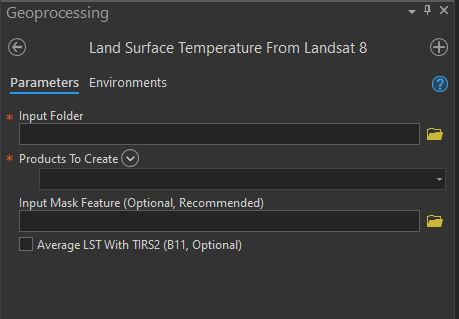

[![LinkedIn][linkedin-shield]][linkedin-url]

  <h3 align="center">Estimate Land Surface Temperature From Landsat 8 bands: Arcpy toolbox</h3>

  

    An ArcGIS Pro Arcpy toolbox that estimates land surface temperature using Landsat 8 bands. 
    Additionally, it will also calculate NDVI, MNDWI, and NDISI.
     For more information, Visit the Project Description Page: 
  <a href='https://ericsamson.com/Python/LandSurfaceTemp/LandSurfaceTemperature.html'>Land Surface Temperature</a>
  

<!-- ABOUT THE PROJECT -->

  

 
<b>Update 11/15/2022</b>: This script tool only currently works with: Landsat Collection 2 Level-1 Product Bundle. Level-2 bundles will not work correctly at the moment.  

  Description: This script estimates the LST and the NDISI of a user's 
  inputted Landsat 8 Bands, with optional outputs of NDVI and MNDWI.
  It only works for Landsat 8 bands. The tool requires a full path to 
  a folder that contains the band's 3, 4, 5, 6, 10, and 11. The MTL metadata 
  file associated with the bands is also required. 
  The zip file of L8 data will contain the *MTL.txt file:
  (Example: LC08_L1TP_147047_20181110_20181127_01_T1_MTL)
  The script will scrap the metadata file for the necessary variables needed 
  for the equations within the script.

  Ouput Rasters Nomenclature: 'LST_184457GMT_20200403' 
  *Estimated Land Surface Temperature_Time Acquired in GMT_Date Acquired*

  The Temperature raster will be in celsius.

  For more documentation and methodology, please visit: 
  https://ericsamson.com/projects/Python-LandSurfaceTemperature.html

  

### How To Add the Tool to ArcGIS:
  -Download the tool as a zip file, unzip to directory of choosing
   -In catalog in ArcGIS Pro, open toolboxes
   -Right click, add toolbox
   -Navigate to the LST_FROMLANDSAT8 toolbox
   -Click ok

### Built With
* [Numpy](https://numpy.org/)
* [Arcpy](https://desktop.arcgis.com/en/arcmap/10.3/analyze/arcpy/a-quick-tour-of-arcpy.htm)
* [ArcGIS Pro](https://pro.arcgis.com/en/pro-app/get-started/get-started.htm)

<!-- CONTACT -->
## Contact
Eric Samson: [@MyTwitter](https://twitter.com/EricSamsonGIS)  
Email: ericsamsonwx@gmail.com  
Website: [EricSamson.com](https://ericsamson.com)  

[linkedin-shield]: https://img.shields.io/badge/-LinkedIn-black.svg?style=flat-square&logo=linkedin&colorB=555
[linkedin-url]: https://linkedin.com/in/iamericsamson
